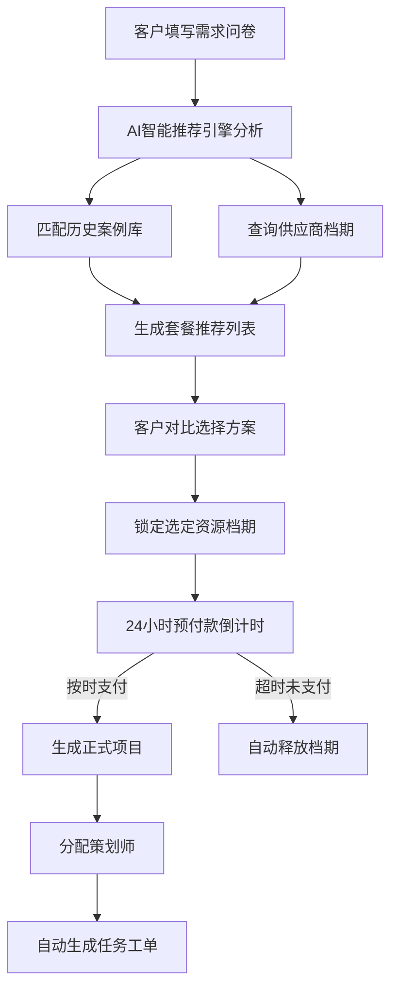
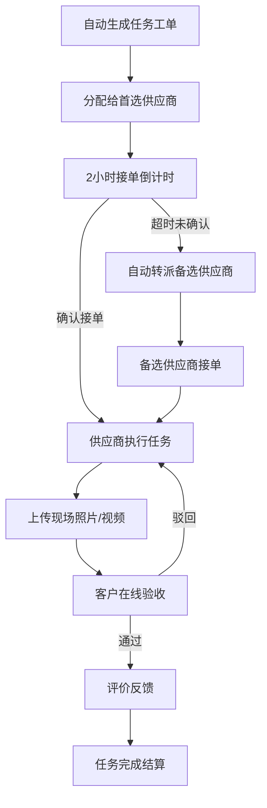
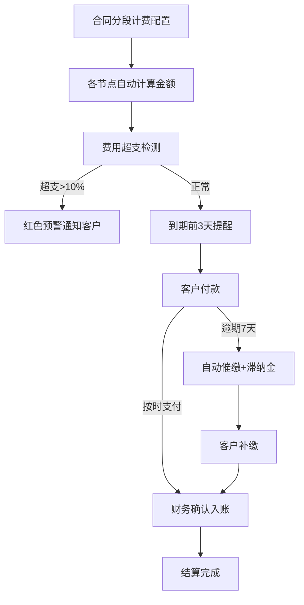

# 智慧婚庆服务管理平台 - 产品需求文档

## 1. 产品概述

智慧婚庆服务管理平台是一套面向婚庆行业的全链路数字化管理系统，整合客户咨询、方案推荐、供应商协同、任务执行和费用结算五大核心业务环节，实现婚礼项目从签约到交付的全流程可视化、智能化管理。

- **核心目标**：解决婚庆行业信息分散、协同效率低、档期冲突、费用管理混乱等痛点
- **目标用户**：新人客户、婚礼策划师、供应商团队、平台管理员
- **产品价值**：通过AI智能推荐和自动化流程，提升策划效率300%，降低档期冲突率95%，客户满意度提升40%

## 2. 核心功能

### 2.1 用户角色

| 角色 | 注册方式 | 核心权限 |
|------|----------|----------|
| 客户 | 手机号注册/邀请链接 | 查看自己的婚礼项目进度、方案、费用、任务验收 |
| 策划师 | 后台创建 | 管理分配的项目、分配任务、调整方案、与客户沟通 |
| 供应商 | 后台创建 | 查看并接单、上传交付物、查看自己的完成率和评价 |
| 管理员 | 超级管理员 | 全局数据管理、推荐规则配置、奖励机制设置、用户管理 |

### 2.2 功能模块

1. **首页数据大屏**：项目进度概览、供应商完成率排行、客户满意度趋势、营收统计、筛选与导出
2. **登录与权限中心**：四级权限登录、角色切换、个人信息管理
3. **客户咨询与方案推荐**：需求问卷、AI智能套餐推荐、组合方案对比、档期锁定、预付款支付
4. **项目管理中心**：婚礼时间线、任务工单、供应商分配、现场照片验收、进度跟踪
5. **供应商协同平台**：任务大厅、接单确认、转派机制、交付上传、业绩统计
6. **费用结算系统**：合同分段计费、超支预警、尾款催缴、滞纳金计算、发票管理
7. **后台管理系统**：推荐规则配置、奖励机制、供应商管理、数据报表导出

### 2.3 页面详情

| 页面名称 | 模块名称 | 功能描述 |
|----------|----------|----------|
| 登录页 | 身份选择器 | 四级角色切换登录、记住密码、验证码 |
| 首页大屏 | KPI指标卡 | 进行中项目数、本月营收、平均满意度、供应商总数 |
| 首页大屏 | 项目进度环 | 各婚礼项目实时进度环形图，颜色区分状态 |
| 首页大屏 | 供应商排行 | 完成率TOP10柱状图，支持按类别筛选 |
| 首页大屏 | 满意度趋势 | 近12个月客户满意度折线图 |
| 首页大屏 | 营收排行 | 按套餐类型分类的营收饼图+月度柱状图 |
| 首页大屏 | 筛选工具栏 | 日期范围、套餐类型筛选，一键导出月度报告 |
| 客户咨询页 | 需求表单 | 预算、人数、婚礼风格、日期、场地偏好填写 |
| 客户咨询页 | 方案推荐 | 基于历史案例和档期的AI推荐列表，含匹配度评分 |
| 客户咨询页 | 方案详情 | 套餐明细、供应商档期、费用明细、对比分析 |
| 客户咨询页 | 档期锁定 | 选定资源即时锁定、24小时倒计时、预付款入口 |
| 项目详情页 | 时间线 | 婚礼任务按时间顺序可视化展示，状态标签 |
| 项目详情页 | 工单列表 | 场地布置/摄影/化妆等环节工单，分配状态跟踪 |
| 项目详情页 | 验收中心 | 现场照片/视频展示、验收确认按钮、评价系统 |
| 供应商工作台 | 任务大厅 | 待接单/进行中/已完成任务Tab切换 |
| 供应商工作台 | 接单确认 | 2小时接单倒计时，超时自动转派提示 |
| 供应商工作台 | 交付上传 | 图片/视频上传、进度反馈、备注说明 |
| 费用中心 | 合同明细 | 分段费用计算、已付/未付/逾期状态标签 |
| 费用中心 | 预警中心 | 超支10%红色预警卡片、客户通知记录 |
| 费用中心 | 催缴管理 | 逾期7天自动催缴、滞纳金计算明细 |
| 系统设置页 | 推荐规则 | 权重配置、算法参数、案例库管理 |
| 系统设置页 | 奖励机制 | 供应商评级、奖金规则、惩罚条款设置 |
| 系统设置页 | 用户管理 | 四级角色增删改查、权限配置 |

## 3. 核心流程

### 3.1 客户签约流程

客户在线填写预算、人数、风格偏好 → 系统根据历史案例和供应商档期推荐套餐 → 客户浏览对比方案 → 选定场地/摄影/化妆资源 → 资源档期即时锁定（24小时倒计时） → 支付预付款 → 生成正式项目 → 分配策划师 → 任务自动生成

### 3.2 任务执行流程

系统按时间线生成各环节工单 → 分配给对应供应商 → 供应商2小时内确认接单 → 超时自动转派下一个供应商 → 供应商执行任务 → 上传现场照片/视频 → 客户在线验收 → 评价反馈 → 任务完成结算

### 3.3 费用结算流程

合同签订时设置分段付款节点 → 各节点自动计算应付金额 → 超支10%自动预警并通知客户 → 尾款到期前3天提醒 → 逾期7天自动催缴 → 按日加收滞纳金 → 财务对账确认 → 完成结算

## 4. 用户界面设计

### 4.1 设计风格

- **主色调**：玫瑰金渐变（#E8C4A0 → #C9A06C）作为品牌色，象征婚礼的浪漫与奢华
- **辅助色**：深酒红（#7B2D26）用于强调和警告，柔粉（#F5E6E0）用于背景层次
- **中性色**：象牙白（#FAF8F5）为背景底色，暖灰（#4A4A4A）为正文文字
- **按钮风格**：圆润胶囊型按钮，主按钮玫瑰金渐变，带微光hover效果
- **字体选型**：标题使用「Noto Serif SC」衬线体体现优雅，正文使用「Noto Sans SC」无衬线体保证可读性
- **布局风格**：卡片式布局+圆角设计，大量留白，分区使用细金线和淡阴影区分
- **图标风格**：线性描边图标（Lucide），统一2px线宽，玫瑰金填充色
- **动效风格**：页面进入时渐入上浮，卡片悬停微抬升+柔光，数据大屏数字滚动计数

### 4.2 页面设计概览

| 页面名称 | 模块名称 | UI元素 |
|----------|----------|--------|
| 登录页 | 身份选择器 | 左侧浪漫婚礼场景大图+品牌标语，右侧玻璃拟态登录卡片，角色切换胶囊按钮，玫瑰金主按钮 |
| 首页大屏 | KPI指标卡 | 四张渐变背景指标卡，数字大号衬线字体，底部趋势小箭头，悬停放大1.02倍 |
| 首页大屏 | 项目进度环 | 环形进度图网格布局，圆心显示百分比，外环颜色表示状态（绿/黄/红） |
| 首页大屏 | 供应商排行 | 横向柱状图，柱体玫瑰金渐变，hover显示详情tooltip，排名前三带奖杯图标 |
| 首页大屏 | 满意度趋势 | 面积折线图，填充淡粉色渐变，数据点圆形标记，X轴月份标签45度倾斜 |
| 首页大屏 | 筛选工具栏 | 顶部固定毛玻璃导航条，胶囊形筛选器，右侧导出按钮带下载图标 |
| 客户咨询页 | 需求表单 | 步骤条引导，问题卡片分组，滑块选预算，风格多选卡片带缩略图 |
| 客户咨询页 | 方案推荐 | 方案卡片瀑布流，匹配度徽章（90%+金色，80%+银色），价格大字突出 |
| 项目详情页 | 时间线 | 左侧竖线时间轴，节点圆形图标，连接线进度颜色渐变，展开动画 |
| 供应商工作台 | 任务卡片 | 左色条表示任务类型，状态徽章右上角，倒计时红色闪烁，底部操作按钮组 |
| 费用中心 | 费用明细 | 表格+卡片混合，超支行红色背景，金额列右对齐加粗，预警弹窗带震动动效 |

### 4.3 响应式设计

- **桌面优先**：以1440px宽度为基准设计，主内容区最大宽度1280px
- **平板适配**：≥768px时，侧边栏折叠为图标模式，卡片网格从4列调整为2列
- **手机适配**：<768px时，顶部导航转为汉堡菜单，图表转为纵向堆叠列表，表格改为卡片式展示
- **触摸优化**：所有可点击元素最小触控区域48×48px，按钮间距≥8px，禁用hover依赖交互
