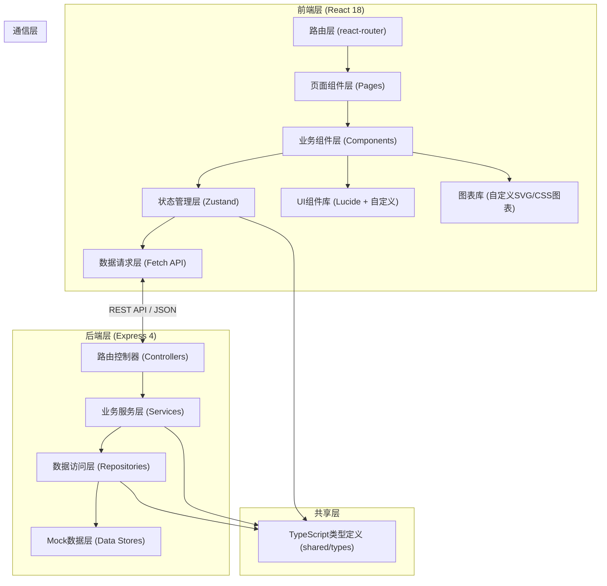
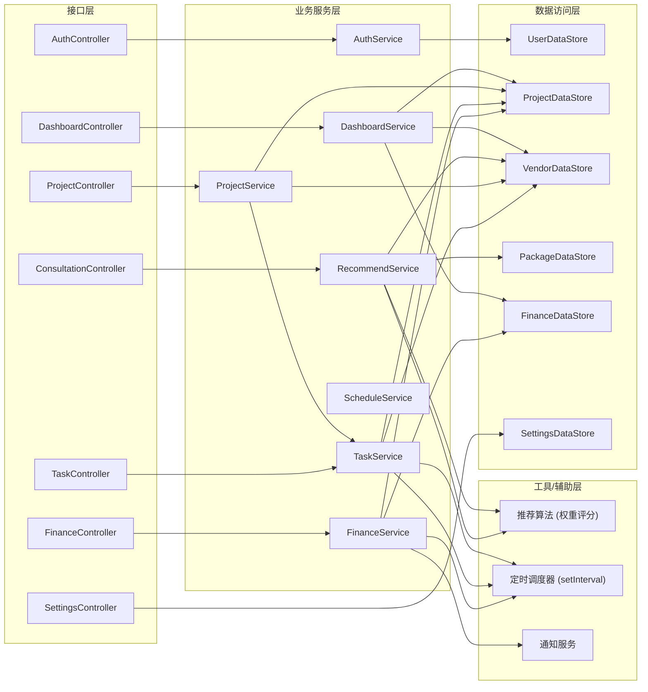

# 智慧婚庆服务管理平台 - 技术架构文档

## 1. 架构设计



## 2. 技术选型说明

- **前端框架**：React@18 + TypeScript@5 - 组件化开发，强类型安全，生态成熟
- **构建工具**：Vite@5 - 极速冷启动，HMR热更新，开箱即用TS支持
- **样式方案**：TailwindCSS@3 - 原子化CSS，统一设计令牌，快速构建UI
- **状态管理**：Zustand@4 - 轻量无侵入，API简洁，TS支持优秀
- **路由管理**：react-router-dom@6 - 声明式路由，嵌套路由，守卫支持
- **图标库**：lucide-react@0.344 - 精美线性图标，统一风格，按需加载
- **后端框架**：Express@4 + TypeScript - 极简灵活，中间件生态，RESTful API
- **数据存储**：内存Mock数据 + 文件持久化 - 无需数据库依赖，快速演示
- **HTTP通信**：原生Fetch API + 自定义封装 - 零依赖，拦截器支持
- **图表可视化**：原生SVG + CSS动画实现 - 无需引入重型图表库，性能最优

## 3. 路由定义

### 3.1 前端路由

| 路由路径 | 页面组件 | 权限要求 | 页面描述 |
|----------|----------|----------|----------|
| `/login` | LoginPage | 公开 | 角色选择登录页 |
| `/` | DashboardPage | 全部角色（按角色过滤数据） | 首页数据大屏 |
| `/consultation` | ConsultationPage | 客户/策划师 | 客户咨询与方案推荐 |
| `/projects` | ProjectsPage | 策划师/管理员 | 项目列表管理 |
| `/projects/:id` | ProjectDetailPage | 客户/策划师/管理员 | 项目详情（时间线+工单+验收） |
| `/vendor` | VendorDashboardPage | 供应商 | 供应商工作台（任务大厅） |
| `/finance` | FinancePage | 策划师/管理员 | 费用结算中心 |
| `/settings` | SettingsPage | 管理员 | 系统设置（推荐规则+奖励机制+用户） |

### 3.2 后端API路由

| 方法 | 路由 | 功能描述 |
|------|------|----------|
| POST | `/api/auth/login` | 用户登录（返回角色+token） |
| GET | `/api/dashboard/overview` | 首页大屏综合数据 |
| GET | `/api/dashboard/realtime` | 实时刷新数据（每5秒） |
| GET | `/api/consultation/packages` | 获取套餐推荐列表 |
| POST | `/api/consultation/recommend` | AI智能推荐方案（基于需求） |
| POST | `/api/consultation/lock` | 锁定档期资源 |
| GET | `/api/consultation/lock-status/:id` | 查询锁定状态（倒计时） |
| GET | `/api/projects` | 获取项目列表（按权限过滤） |
| GET | `/api/projects/:id` | 获取项目详情（含时间线+工单） |
| POST | `/api/projects` | 创建新项目 |
| GET | `/api/tasks` | 获取任务列表（供应商视角） |
| POST | `/api/tasks/:id/accept` | 供应商接单确认 |
| POST | `/api/tasks/:id/reassign` | 超时自动转派 |
| POST | `/api/tasks/:id/submit` | 提交交付物（照片/视频） |
| POST | `/api/tasks/:id/verify` | 客户验收确认 |
| GET | `/api/finance/projects` | 获取费用项目列表 |
| GET | `/api/finance/:id/detail` | 获取费用明细 |
| GET | `/api/finance/warnings` | 获取超支预警列表 |
| POST | `/api/finance/remind` | 触发催缴通知 |
| GET | `/api/settings/recommend-rules` | 获取推荐规则配置 |
| POST | `/api/settings/recommend-rules` | 更新推荐规则 |
| GET | `/api/settings/rewards` | 获取奖励机制配置 |
| POST | `/api/settings/rewards` | 更新奖励机制 |
| GET | `/api/users` | 获取用户列表 |
| POST | `/api/reports/monthly` | 生成月度运营分析报告 |

## 4. API数据结构定义

```typescript
// ======== 共享类型定义 ========

export type UserRole = 'customer' | 'planner' | 'vendor' | 'admin';

export interface User {
  id: string;
  name: string;
  role: UserRole;
  phone: string;
  email?: string;
  avatar?: string;
  vendorType?: 'venue' | 'photography' | 'makeup' | 'flowers' | 'catering';
}

export interface AuthResponse {
  token: string;
  user: User;
  permissions: string[];
}

// ======== 首页大屏数据 ========

export interface DashboardOverview {
  kpis: {
    activeProjects: number;
    activeProjectsDelta: number;
    monthlyRevenue: number;
    monthlyRevenueDelta: number;
    avgSatisfaction: number;
    avgSatisfactionDelta: number;
    totalVendors: number;
    totalVendorsDelta: number;
  };
  projectProgress: {
    projectId: string;
    coupleName: string;
    weddingDate: string;
    progress: number;
    status: 'normal' | 'warning' | 'danger';
    packageType: string;
  }[];
  vendorRanking: {
    vendorId: string;
    vendorName: string;
    vendorType: string;
    completionRate: number;
    totalTasks: number;
    avgRating: number;
    rank: number;
  }[];
  satisfactionTrend: {
    month: string;
    score: number;
    projectCount: number;
  }[];
  revenueBreakdown: {
    categories: { name: string; value: number }[];
    monthly: { month: string; revenue: number; cost: number }[];
  };
}

// ======== 客户咨询与推荐 ========

export interface ConsultationForm {
  budget: [number, number];
  guestCount: number;
  weddingDate: string;
  styles: string[];
  preferredCity: string;
  venueType?: string;
  specialRequirements?: string;
}

export interface PackagePlan {
  planId: string;
  name: string;
  matchScore: number;
  totalPrice: number;
  originalPrice: number;
  packageType: 'basic' | 'standard' | 'premium' | 'custom';
  includes: {
    venue: PackageItem;
    photography: PackageItem;
    makeup: PackageItem;
    flowers?: PackageItem;
    catering?: PackageItem;
    mc?: PackageItem;
  };
  casePhotos: string[];
  highlights: string[];
  availableSlots: number;
}

export interface PackageItem {
  id: string;
  name: string;
  vendorName: string;
  price: number;
  rating: number;
  available: boolean;
  thumbnail: string;
}

export interface LockResult {
  lockId: string;
  lockedAt: string;
  expiresAt: string;
  items: { type: string; name: string; locked: boolean }[];
  totalDeposit: number;
}

// ======== 项目与任务 ========

export type ProjectStatus = 'pending' | 'active' | 'completed' | 'cancelled';
export type TaskStatus = 'pending' | 'assigned' | 'accepted' | 'in_progress' | 'submitted' | 'verified' | 'reassigned';
export type TaskType = 'venue' | 'photography' | 'makeup' | 'flowers' | 'catering' | 'mc' | 'decor';

export interface WeddingProject {
  id: string;
  coupleName: string;
  weddingDate: string;
  location: string;
  guestCount: number;
  totalBudget: number;
  spentAmount: number;
  status: ProjectStatus;
  progress: number;
  plannerId: string;
  plannerName: string;
  customerId: string;
  packageType: string;
  timeline: TimelineEvent[];
  tasks: Task[];
}

export interface TimelineEvent {
  id: string;
  title: string;
  description: string;
  scheduledAt: string;
  completedAt?: string;
  status: 'upcoming' | 'in_progress' | 'completed' | 'delayed';
  taskType?: TaskType;
}

export interface Task {
  id: string;
  projectId: string;
  type: TaskType;
  title: string;
  description: string;
  assignedVendorId?: string;
  assignedVendorName?: string;
  backupVendorId?: string;
  status: TaskStatus;
  deadline: string;
  acceptedAt?: string;
  reassignedCount: number;
  submissions: Submission[];
  verification?: Verification;
}

export interface Submission {
  id: string;
  taskId: string;
  submittedAt: string;
  mediaUrls: string[];
  note: string;
  submittedBy: string;
}

export interface Verification {
  verifiedAt: string;
  verifiedBy: string;
  rating: number;
  comment: string;
}

// ======== 费用结算 ========

export interface FinanceRecord {
  id: string;
  projectId: string;
  coupleName: string;
  contractAmount: number;
  paidAmount: number;
  pendingAmount: number;
  overdueAmount: number;
  lateFee: number;
  installments: Installment[];
  warnings: FinanceWarning[];
  status: 'normal' | 'warning' | 'overdue';
  overrunPercentage: number;
}

export interface Installment {
  id: string;
  name: string;
  amount: number;
  dueDate: string;
  paidAt?: string;
  status: 'pending' | 'paid' | 'overdue';
  percentage: number;
}

export interface FinanceWarning {
  id: string;
  type: 'overrun' | 'overdue';
  message: string;
  triggeredAt: string;
  notifiedCustomer: boolean;
  severity: 'low' | 'medium' | 'high';
}

// ======== 系统设置 ========

export interface RecommendRules {
  budgetWeight: number;
  styleWeight: number;
  dateWeight: number;
  vendorRatingWeight: number;
  historicalCaseWeight: number;
  autoLockHours: number;
  acceptTimeoutHours: number;
  overrunWarningThreshold: number;
  overdueReminderDays: number;
  lateFeeRatePerDay: number;
}

export interface RewardRules {
  vendorTiers: { tier: string; minCompletionRate: number; bonusRate: number }[];
  taskAcceptBonus: number;
  fastDeliveryBonus: number;
  highRatingBonus: number;
  reassignmentPenalty: number;
  overduePenalty: number;
}
```

## 5. 后端服务架构图



## 6. 数据模型设计

### 6.1 实体关系图

```mermaid
erDiagram
    USER ||--o{ PROJECT : "客户创建"
    USER ||--o{ PROJECT : "策划师管理"
    USER ||--o{ TASK : "供应商执行"
    PROJECT ||--|{ TASK : "包含"
    PROJECT ||--|{ INSTALLMENT : "包含"
    PROJECT ||--o{ FINANCE_WARNING : "触发"
    TASK ||--o{ SUBMISSION : "上传"
    TASK ||--o| VERIFICATION : "验收"
    PACKAGE_PLAN ||--o{ PACKAGE_ITEM : "包含"
    VENDOR ||--o{ TASK : "接单"
    VENDOR ||--o{ PACKAGE_ITEM : "提供服务"

    USER {
        string id PK
        string name
        UserRole role
        string phone
        string vendorType
    }

    PROJECT {
        string id PK
        string coupleName
        string weddingDate
        number totalBudget
        number spentAmount
        ProjectStatus status
        number progress
        string customerId FK
        string plannerId FK
    }

    TASK {
        string id PK
        string projectId FK
        TaskType type
        TaskStatus status
        string assignedVendorId FK
        number reassignedCount
    }

    VENDOR {
        string id PK
        string name
        string serviceType
        number rating
        number completionRate
    }

    SUBMISSION {
        string id PK
        string taskId FK
        string[] mediaUrls
        string note
    }

    VERIFICATION {
        string id PK
        string taskId FK
        number rating
        string comment
    }

    PACKAGE_PLAN {
        string id PK
        string name
        number matchScore
        number totalPrice
    }

    INSTALLMENT {
        string id PK
        string projectId FK
        string name
        number amount
        string dueDate
    }
```



### 6.2 初始化数据（Mock）

初始化数据包含：
- 4个测试用户（客户/策划师/供应商/管理员各1）
- 8个进行中的婚礼项目（不同进度/套餐类型）
- 12个供应商（场地/摄影/化妆/花艺/餐饮各2-3个）
- 16个套餐方案（基础/标准/豪华/定制各4个）
- 12个月的历史满意度与营收数据
- 24个任务工单（不同状态分布）
- 5条费用预警记录（超支/逾期）

数据通过 `src/shared/mock-data.ts` 集中管理，后端通过内存数据模拟持久化。
